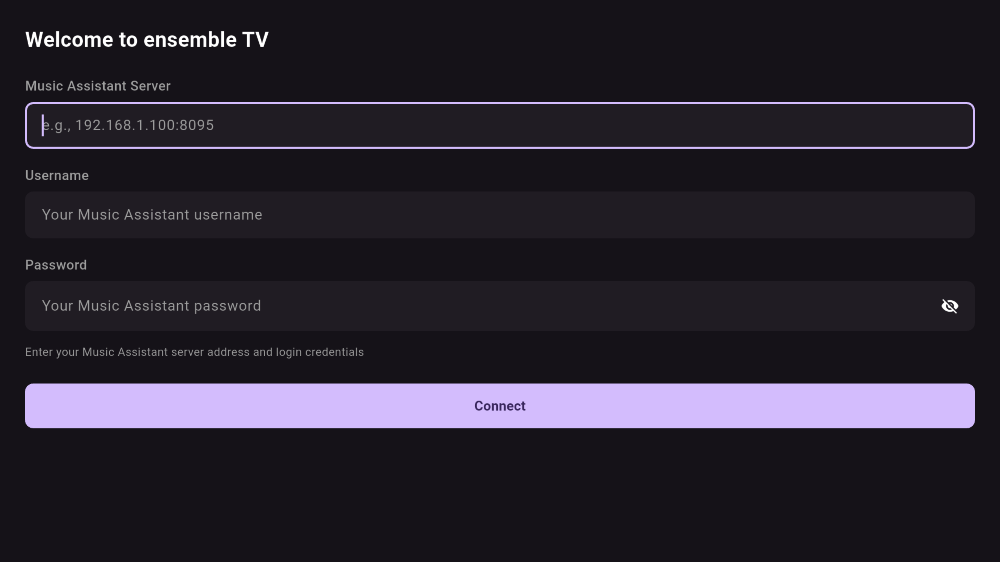

# Ensemble TV

A simple Flutter-based Google TV client for [Music Assistant](https://github.com/music-assistant/server).

## What This App Is

Ensemble TV is a **minimal, focused app** that does one thing: displays what's currently playing on a selected Music Assistant player.

**It won't be getting a ton of development.** It's intentionally simple - a "now playing" display for your TV with basic remote control. If you're looking for a full-featured Music Assistant client with browsing, search, playlists, and library management, this isn't it.

### What It Does

- Shows album art and track info on your TV
- Play/pause, skip, volume via remote
- Switch between Music Assistant players

### What It Doesn't Do

- Browse your library
- Search for music
- Manage playlists
- Queue management
- Fancy visualizations

## Requirements

- Android TV device (tested on NVIDIA Shield)
- Music Assistant server running on your network
- WebSocket port enabled on Music Assistant (default: 8095)

## Installation

1. Download the latest `app-release.apk` from [Releases](https://github.com/CollotsSpot/ensemble-tv/releases)
2. Copy to your Android TV device (via USB, network share, or adb)
3. Install using a file manager or `adb install app-release.apk`

## First Run

On first launch, you'll need to configure:

1. **Server URL** - Your Music Assistant server address (e.g., `http://192.168.1.100:8095`)
2. **Login** - Enter your Music Assistant username and password
3. **Select Player** - Choose which player to control

## Remote Controls

| Button | Action |
|--------|--------|
| Select/Enter | Play/Pause |
| D-Pad Left/Right | Previous/Next track |
| D-Pad Up/Down | Volume Up/Down |
| M | Mute/Unmute |
| S | Toggle Shuffle |
| R | Cycle Repeat Mode (Off → All → One) |
| Page Up/Down | Seek backward/forward 10 seconds |

## Screenshots

### Now Playing
Large album art display with track info and progress bar. The app extracts the dominant color from album art to create a matching background gradient.


### Player Select
Choose from available Music Assistant players with visual status indicators.


### Settings
Configure your Music Assistant server connection and credentials.



## Home Assistant Integration

If you use Home Assistant, you can set up an automation to automatically launch Ensemble TV when your Music Assistant player starts playing.

### Example Automation

```yaml
alias: "Ensemble TV - Auto Launch When Music Plays"
description: "Launch Ensemble TV app when Music Assistant player starts playing"
trigger:
  - platform: state
    entity_id: media_player.living_room_hifi  # Your Music Assistant player
    to: playing
action:
  - service: androidtv.adb_command
    target:
      entity_id: media_player.android_tv_192_168_1_100  # Your Shield/Android TV
    data:
      command: am start -n com.collotsspot.ensemble_tv/.MainActivity
```

### Requirements

- [Android TV integration](https://www.home-assistant.io/integrations/androidtv/) configured in Home Assistant
- ADB debugging enabled on your Android TV device
- Your Music Assistant player set up as a `media_player` entity in Home Assistant

### Notes

- Replace `media_player.living_room_hifi` with your actual Music Assistant player entity
- Replace `media_player.android_tv_192_168_1_100` with your Android TV entity
- You can add multiple triggers for different players
- The automation works with the Android TV ADB integration to launch apps remotely

## Development

Built with Flutter for Android TV's leanback UI. Minimal feature set, minimal maintenance.

**Tech Stack:**
- Flutter 3.x
- Provider for state management
- WebSocket connection to Music Assistant

## License

MIT License

## Acknowledgments

- [Music Assistant](https://github.com/music-assistant/server) - The excellent music server
